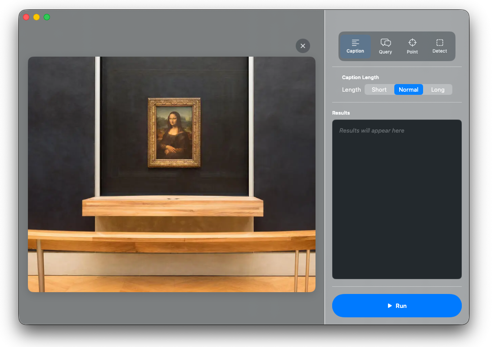

# Moondream MLX

Vision-language model implementations using Apple's MLX framework for on-device inference.



## Components

| Component | Platform | Status |
|-----------|----------|--------|
| **MoondreamKit** | Swift Package | Working - Reusable model package |
| **Moondream** | macOS + iOS | Working - Unified app |

## Models

| Model | ID | Size | Notes |
|-------|-----|------|-------|
| Int8 | Local path | 10.2 GB | Int8 quantized |
| Standard | `moondream/md3p-int4` | 6.48 GB | MoE int4, Vision BF16 |
| Compact | `lewi/md3p-int4-smol` | 5.43 GB | Full int4, iOS optimized |

## Features

- **Query**: Ask questions about images
- **Caption**: Generate descriptions (short/normal/long)
- **Point**: Locate objects by coordinates
- **Detect**: Find objects with bounding boxes

## Moondream App

Unified Swift app with both macOS and iOS targets, built on MoondreamKit.

### macOS Features

- **Modern UI** - Semi-transparent design with hidden title bar
- **Drag & Drop** - Drop images directly onto the app
- **Webcam Capture** - Use built-in camera for live image capture
- **4 Skills** - Caption, Query, Point, Detect
- **Real-time Processing** - Progress indicators and streaming results
- **CLI Mode** - Command-line interface for scripting

### iOS Features

- **Modern UI** - Native iOS 26 design with translucent effects
- **Camera-First** - Live camera preview with capture
- **Model Selection** - Download and switch between Standard/Compact models
- **Download Progress** - Visual progress with cancel support
- **Results Overlay** - Display bounding boxes and point markers

### Requirements

- macOS 15+ / iOS 26+
- Apple Silicon (M1/M2/M3/M4) for Mac
- iPhone 15 Pro or newer for iOS (8GB+ RAM recommended)
- Xcode 17+

### Build & Run

```bash
# Open in Xcode (recommended)
open Moondream/Moondream.xcworkspace

# Or build from command line
cd Moondream

# Build macOS
xcodebuild -scheme Moondream-macOS -configuration Debug build

# Build iOS
xcodebuild -scheme Moondream-iOS -destination 'generic/platform=iOS Simulator' build
```

**Note:** `swift run` does not work due to Metal shader bundling issues. Must use Xcode build.

### CLI Mode (macOS)

```bash
# Caption
./Moondream image.png caption:normal

# Query
./Moondream image.png query "What is in this image?"

# Point (locate object)
./Moondream image.png point "the red button"

# Detect (bounding boxes)
./Moondream image.png detect "people"

# Use a specific model (HuggingFace ID or local path)
./Moondream image.png caption:short --model lewi/md3p-int4-smol
./Moondream image.png query "Describe this" --model /path/to/local/model
```

## Integrating MoondreamKit

MoondreamKit is a standalone Swift package you can integrate into your own apps. The package follows a modular architecture with 38 focused files organized by component (Vision, Language, Region, Generation).

### Installation

Add MoondreamKit to your project via Swift Package Manager:

**In Xcode:**
1. File → Add Package Dependencies
2. Enter: `https://github.com/l3wi/moondream-osx.git`
3. Select "MoondreamKit" product

**In Package.swift:**
```swift
dependencies: [
    .package(url: "https://github.com/l3wi/moondream-osx.git", branch: "main")
],
targets: [
    .target(
        name: "YourApp",
        dependencies: [
            .product(name: "MoondreamKit", package: "moondream-osx")
        ]
    )
]
```

### Quick Start

```swift
import MoondreamKit
import CoreImage

// 1. Load the model (downloads ~6GB on first run)
let container = try await Moondream3Loader.loadContainer(
    configuration: Moondream3Loader.defaultConfiguration
) { progress in
    print("Loading: \(Int(progress.fractionCompleted * 100))%")
}

// 2. Prepare your image as MLXArray pixels
let ciImage: CIImage = // your image
let pixels = try Moondream3.loadImage(ciImage)

// 3. Run inference
let result = container.perform { context in
    context.model.caption(
        pixels: pixels,
        length: "normal",
        tokenizer: context.tokenizer,
        maxTokens: 768,
        temperature: 0.0
    )
}
print(result) // "A photo of..."
```

### Available Skills

```swift
// Caption - Generate descriptions
context.model.caption(pixels:length:tokenizer:maxTokens:temperature:)

// Query - Ask questions
context.model.query(pixels:question:tokenizer:maxTokens:temperature:)

// Point - Get object coordinates (returns JSON with x,y normalized 0-1)
context.model.point(pixels:object:tokenizer:maxTokens:temperature:)

// Detect - Get bounding boxes (returns JSON with xmin,ymin,xmax,ymax)
context.model.detect(pixels:object:tokenizer:maxTokens:temperature:)
```

### Model Options

```swift
// Standard model (6.48 GB) - Best quality
Moondream3Loader.defaultConfiguration  // "moondream/md3p-int4"

// Compact model (5.43 GB) - Faster, iOS optimized
Moondream3Loader.compactConfiguration  // "lewi/md3p-int4-smol"
```

### Important Notes

- **Xcode required**: Must build with Xcode (not `swift build`) due to Metal shader bundling
- **First launch**: Model downloads from HuggingFace (~6GB) and is cached locally
- **Memory**: Requires 8GB+ RAM; model auto-unloads after 60s inactivity on macOS

See [MoondreamKit/README.md](MoondreamKit/README.md) for detailed API documentation.

## Architecture

```
moondream-mlx/
├── MoondreamKit/                    # Swift Package (reusable, 38 files)
│   ├── Package.swift
│   └── Sources/MoondreamKit/
│       ├── Configuration/           # Model & processor configs
│       │   ├── Moondream3Configuration.swift
│       │   └── PlatformConfiguration.swift
│       ├── Constants/
│       │   └── TokenConstants.swift # Centralized token IDs
│       ├── Generation/
│       │   └── GenerationHelpers.swift # Shared sampling & coordinate gen
│       ├── Layers/
│       │   ├── RotaryEmbedding.swift # RoPE implementation
│       │   └── KVCacheManager.swift  # KV cache allocation
│       ├── Vision/                  # Vision encoder components
│       │   ├── VisionEncoder.swift
│       │   └── Quantized/           # Quantized variants
│       ├── Language/                # Language model components
│       │   ├── TextModel.swift
│       │   ├── MoEMLP.swift         # Mixture of Experts
│       │   └── Quantized/           # Quantized variants
│       ├── Region/                  # Coordinate/detection model
│       │   ├── RegionModel.swift
│       │   └── FourierFeatures.swift
│       ├── Model/
│       │   ├── Moondream3.swift     # Standard model (~300 lines)
│       │   └── Moondream3Quantized.swift # Compact model (~280 lines)
│       ├── Protocols/
│       │   └── MoondreamModelProtocol.swift # Shared interface
│       ├── Loader/
│       │   └── Moondream3Loader.swift
│       ├── Cache/
│       │   └── ModelCache.swift
│       ├── Processor/
│       │   └── Moondream3Processor.swift
│       ├── Models/                  # Data types
│       │   ├── ModelInfo.swift
│       │   ├── Skill.swift
│       │   └── CoordinateTypes.swift
│       └── Utilities/
│           └── Logger.swift
├── Moondream/                       # Unified Swift app (macOS + iOS)
│   ├── Moondream.xcworkspace
│   ├── Sources/
│   │   ├── Shared/                  # Cross-platform code
│   │   │   └── Services/MoondreamService.swift
│   │   ├── macOS/                   # Mac-specific UI
│   │   └── iOS/                     # iOS-specific UI
└── docs/tasks/                      # Task documentation
```

## License

MIT
